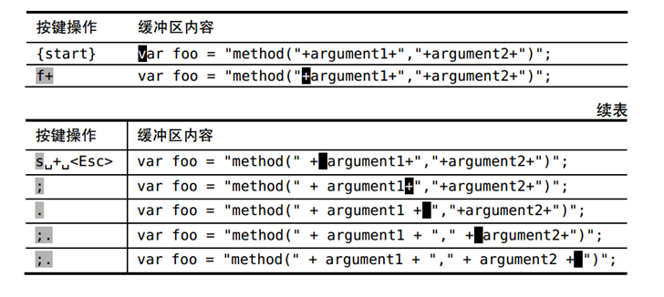
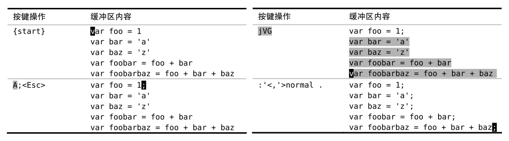

# vimBasics
vim基本用法——入门篇

------
## 初识Vim
### vim -u NONE -N
vimrc的设置和插件均被禁用。设置为vi非兼容模式。  
-u NONE 标志让 Vim 在启动时不加载你的 vimrc，这样，你的定制项就不会生效，**插件也会被禁用**。当用不加载 vimrc 文件的方式启动时， Vim 会切换到 vi 兼容模式，这将导致很多有用的功能被禁用，而 -N 标志则会使能"nocompatible" 选项，防止进入 vi 兼容模式。

### vim -u bookcode/essential.vim
激活了内置的插件功能，并且禁用了 vi 兼容模式。

### :version
查看vim的版本（需要打开vim后查看）。

### :h vimtutor
查看Vim的内置文档。  
也可以用`:h`来查看帮助文档，比如`:h .`查看`.`的介绍。

### 技巧1 `.` Repeat last change/重复上次修改
这里提到的"上次修改"是两个ESC之间的所有操作。

### 技巧2 `A` 相当于 `$a`，一箭双雕
`a` 命令在当前光标之后添加内容，而 `A` 命令则在当前行的结尾添加内容。不管光
标当前处于什么位置，输入 `A` 都会进入插入模式，并把光标移到行尾。换句话说，它
把 `$a` 封装成了一个按键操作。

### 技巧3 `f{char}` & `；` & `s`
- `f{char}`，查找下一处指定字符出现的位
置，如果找到了，就直接把光标移到那里。
- `;`，重复查找上次 `f` 命令所查找的字符。
- `s`，先删除光标下的字符，然后进入插入模式。把以上两个操作合并为一个。  

### 技巧4 `u`，撤销，undo

### 技巧5 `*` 单键命令，在匹配项间跳转
- 全局替换: `:%s/content/copy/g`
- 查找提示符 + 待查找的单词，example: `/content`
- 把光标移到单词上，然后按 `*` 键，无需输入就可以进行查找
  - 光标会跳到下一个匹配项上
  - 所有出现这个词的地方都会被高亮显示出来
  - 按 `n` 键就可以跳到下一个匹配项，按 `N` 键就可以跳到上一个匹配项
- `cw` 命令会删除从光标位置到单词结尾间的字符，并进入插入模式

------
## 普通模式(normal mode)
一次修改：从进入插入模式开始，直到退出此模式，返回普通模式为止，在此期间输入或者删除的任何内容。

### 技巧8 把撤销单元切成块
`u` 命令为撤销命令，会撤销最新的修改，可能是字符、单词、句子、段落。  
在vim中，可以自己控制撤销命令的粒度。这种把握度需要对vim足够的熟悉。

### 技巧9 构造可重复的修改
最后一个方案是最佳的，因为不仅删除了单词，还会删除一个空格，最后光标停在单词 is 的最后一个字符上。如果此时使用`.`命令，它会重复上次删除单词的命令。即可重复的修改。

- `db`，删除从光标起始位置到单词开头的内容，但会原封未动地留下最后一个字符
- `x`，删除光标所在字符
- `b`，把光标移到单词的开头，即backward
- `dw`，delete word，删除整个单词
- `daw`，delete a word，其中`aw`是一个文本对象

### 技巧10 `<C-a>` 和 `<C-x>` 命令分别对数字执行加、减操作
例如，把光标移到字符 5 上，执行 `10<C-a>`就会把它变成 15。
- `yyp`，复制+粘贴光标所在的行

### 技巧11 `d2w`次数风格 or `dw.`重复风格
|执行|重复|回退|
|-|-|-|
|`d2w`, `2dw`|`.`，每次删除两个单词|u|
|`dw.`|`.`，每次删除一个单词|`uu`，`2u`|  

取决于你怎么看保留干净撤销历史记录的价值，以及你是否觉得用次数令人生厌。  

### 技巧12 操作符 + 动作命令 = 操作，双剑合璧天下无敌
`d{motion}` 命令可以对一个字符（`dl`）、一个完整单词（`daw`）或一整个段落（`dap`）进行操作，它作用的范围由动作命令决定。 `c{motion}`、`y{motion}`以及其他一些命令也类似，它们被统称为操作符（operator）。你可以用`:h operator` 来查阅完整的列表。  
  

Vim 的语法只有一条额外规则，即**当一个操作符命令被连续调用两次时，它会作用于当前行。  
所以 `dd` 删除当前行， `>>` 缩进当前行。**

------
## 插入模式(insert mode)

### 技巧13 在插入模式中删除
- `Ctrl h`，删除前一个字符，同退格键
- `Ctrl w`，删除前一个单词
- `Ctrl u`，删除至行首

### 技巧14 返回普通模式
`Ctrl [`，效果同`ESC`，切换到普通模式。

### 技巧19 替换模式
`R` 命令可以由普通模式进入替换模式，完成替换后，就可以按 `<Esc>` 键返回普通模式。  
如果键盘上有 `<Insert>` 键，那么也可以用该键在插入模式和替换模式间切换。

------
## 可视模式
Vim的可视模式允许我们选中一块文本区域并在其上进行操作。Vim具有3种不同的可视模式，分别用于操作字符文本、行文本或块文本。
- 很多普通模式的命令，在可视模式中也完成相同的功能
- 某些可视模式命令执行的基本功能与普通模式相同，但操作上有些细微的变化。  
例如，在这两种模式中， `c` 命令的功能是一样的，都是删除指定的文本并切换到插入模式。不过，要指定其所操作的范围，二者的方式却不甚相同。在普通模式中，我们先触发修改命令，然后使用动作命令指定其作用范围，然而在可视模式中，我们先选中选区，然后再触发修改命令。
- 例子，把单词“March”修改为“April”
  - 先把光标移到单词“March”的某个位置
  - 执行 `viw` 高亮选择这个词
  - 用 `c` 命令修改所选内容，即把这个单词删掉并进入插入模式
  - 然后输入“April”

### 技巧21 选择高亮选区
在普通模式下，激活可视模式的方法如下。由可视模式回到普通模式的方法与插入模式相同，即`<Esc>`或者`Ctrl-[`。  
  
**切换选区的活动端**  
高亮选区的范围由其两个端点界定。其中一端固定，而另一端可以随光标自由移动，我们可以用 **`o` 键来切换其活动的端点**，并调整选区的边界。

### 技巧22 `.`命令可以重复执行面向行的可视命令
当使用 `.` 命令重复对高亮选区所做的修改时，此修改会重复作用于相同范围的文本。  

### 技巧24 以列为单位的文本操作
- `Ctrl-v`，进入列块可视模式
- `gv`命令重选上次的高亮选区
- `r{char}`，Replace the character under the cursor with {char}，用新字符`{char}`替换光标选中的每个位置的内容  

### 技巧25/26 修改列文本
用列块可视模式可以同时往若干行中插入文本。  
当我们在插入模式中输入单词"components"时，此单词只出现在顶行，下面的两行没什么变化。只有在按了 <Esc> 返回到普通模式后，我们才看到刚才输入的文本出现在下面这两行里。  
  

除了操作由行列组成的方形文本区域，还可以处理长短不一的情况。  
在每行的行尾添加分号。  

------
## 命令行模式
### 技巧27 结识Vim的命令行模式
在按下 `:` 键时，Vim 会切换到命令行模式，然后按 `<ENTER>` 执行它。在任意时刻，我们都可以按 `<Esc>`键从命令行模式切换回普通模式。  
我们可以用 Ex 命令读写文件（ :edit 和 :write ），创建新标签页（:tabnew ）及分割窗口（ :split ）。参见 `:h ex-cmd-index` 可获得完整列表。

### 技巧28 在指定的范围执行命令
- 用行号作为地址
  - **`:1`，跳到第1行**
  - `:5`，跳到第5行
  - **`:$`，跳到最后一行**
  - `:3d`，跳到第3行，并删除此行  

- 用地址指定一个范围
  - `:2,5d`，删除第2到第5行，包含第2和第5行
  - `:{start},{end}`
  - **`.`，表示当前行的地址。`%`，当前文件的所有行**
  - `:.,$d`
  - `:.,.+3d`

### 技巧29 使用`:t` 和 `:m` 复制和移动行
- `:copy` 命令可以简写为两个字母 `:co`，或者也可以用更加简练的 `:t`命令，它是 `:copy`命令的同义词(复制到，copy to)。
- `:move` 命令可以简写为一个字母 `:m`  

### 技巧30 `:normal`命令，可以在指定范围上执行普通模式命令
在一系列行后添加一个分号，如技巧2所示。现在有另一种方法，在更多行的情况下更有效。  
  
- `:'<,'>normal .` 命令可以解读为“对高亮选区中的每一行，对其执行普通模式
下的 `.` 命令”
- `:%normal A;`  
**符号 `%` 代表整个文件范围**，因此 `:%normal A;` 告诉 Vim 在文件每行的结尾都
添加一个分号。在做此修改时会切换到插入模式，但是在修改完后 Vim 会自动返回到
普通模式。
- `:%normal i#`, 注释  
在执行指定的普通模式命令之前，Vim 会先把光标移到该行的起始处。因此在执行
时，用不着担心光标的位置。

### 技巧31/32 重复命令、自动补全
`@:` 命令，重复上次的Ex命令  
`<Tab>`键，自动补全命令

### 技巧33 把当前单词插入到命令行
在 Vim 的命令行下， `<C-r><C-w>` 映射项会复制光标下的单词并把它插入到命
令行中。  
将光标放在"tally"上，命令行：`:%s/<C-r><C-w>/counter/g`, `<C-r><C-w>`会映射成"tally"。

### 技巧34 回溯历史命令
Vim 会记录命令行模式下的命令历史，Vim 缺省会记录最后 20 条命令。
- 先按 `:` 键切换到命令行模式，在保持提示符为空的情况下按 `<Up>` 和 `<Down>` 键查看命令记录
- 按 `/` 调出查找提示符后，用 `<Up>` 和 `<Down>` 键就可以正向或反向遍历之前的查找记录  

命令行窗口就像是一个常规的 Vim 缓冲区，只不过它的每行内容都对应着命令历史中的一个条目。   
**在普通模式下，输入`q:`可以打开Ex命令记录的命令行窗口，输入`q/`可以查找命令记录的命令行窗口。**

### 技巧35 运行Shell命令
- 把Vim置于后台
  - 先按 `Ctrl-z` 挂起 Vim 所属的进程，并把控制权交还给 bash
  - 用 `jobs` 命令查看当前的作业列表
  - 在 bash 中，用 `fg` 命令唤醒一个被挂起的作业，把它移到前台。这会让 Vim恢复成挂起前的状态
- 在 Vim 的命令行模式中，给命令加一个叹号前缀 `!` 就可以调用外部程序
  - `:!ls`
  - 在 Vim 的命令行中，符号 `%` 代表当前文件名
- 用外部的 sort 命令对CSV文件中的记录进行排序
  - `:2,$!sort -t',' -k2`
  - `-t’,’` 参数告诉sort 命令，这些记录以逗号分隔
  - `-k2` 参数指定按第二个字段进行排序
  - `:2,$` 范围只取第2行到结尾，把第一行排除在排序范围之外  

------
## 管理多个文件
### 技巧36 缓冲区
文件是存储在磁盘上的，而缓冲区则存在于内存中。当 Vim 打开一个文件时，该文件的内容被读入一个具有相同名字的缓冲区。刚开始，缓冲区的内容和文件的内容完全相同，但当我们对缓冲区做出修改时，二者的内容就会出现差别。如果我们决定保留这些修改，就可以再把缓冲区的内容写回到文件里。绝大多数Vim命令都用来操作缓冲区，不过也有一些命令针对文件进行操作，这当中包括 :write 、 :update及 :saveas 命令。

### 技巧39 将工作区切分成窗口
在 Vim 术语中，窗口是缓冲区的显示区域。可以打开多个窗口，在这些窗口中显示同一个缓冲区，也可以在每个窗口里载入不同的缓冲区。   
- `:edit {file}` 命令把另外一个缓冲区载入活动窗口中
- `:sp[lit] {file}`，水平切分当前窗口，并在新窗口中载入{file}
- `:vsp[lit] {file}`，垂直切分当前窗口，并在新窗口中载入{file}
- `Ctrl-w`，在窗口间循环切换
- `:on[ly]`，只保留活动窗口，关闭其他所有窗口

### 技巧40 标签页
- `:tabe[dit] {filename}`，打开一个新的标签页
- `:tabn[ext]`，`gt`，切换到下一个标签页
- `:tabp[revious]`，`gT`，切换到上一个标签页

### 技巧44 把文件保存到不存在的目录中
- `:!mkdir -p %:h`，创建文件所在路径的目录
- `%:h<Tab>`，当前文件所在目录的路径

------
## 动作命令
移动和跳转  
移动光标的命令: `h`、`j`、`k`、`l`、`gj`、`gk`。  
`j` 和 `k` 命令会根据实际行向下及向上移动，而 `gj` 和 `gk` 则是按屏幕行向下及向上移动，即**区分实际行与屏幕行**。  

### 技巧48 基于单词移动
  
`w` 和 `b` 命令都以词首为目标，而 `e` 和 `ge` 命令则是以词尾为目标。 `w` 和 `e` 都正向移动光标，而 `b` 和 `ge` 命令则反向移动光标。

**“单词”（word）和“字串”（WORD）**，一个单词由字母、数字、下划线，或其他非空白字符的序列组成，单词间以空白字符分隔。而字串的定义则更简单，它由非空白字符序列组成，字串间以空白字符分隔。  
`W`、`B`、`E` 和 `gE`是对应的WORD的操作。两者的粒度不同。

### 技巧49 对字符进行查找
之前提到过的 `f{char}` 命令是在 Vim 中移动的最快方式之一。它会在光标位置与当前行行尾之间查找指定的字符，如果找到了，就会把光标移到此字符上；如果未找到，则保持光标不动。  
与`f{char}`结合使用的是`;`和`,`命令。即技巧4中的口诀：执行、重复、回退。  
`f,dt.`，先把光标直接移到逗号上，接下来删除从逗号到句尾的所有文本，但又不删除句号。  
  

如果你正在阅读的文本，它们几乎全是由小写字母组成的，而大写字母则要少得多，标点符号也很少。因此，在使用字符查找命令时，最好是选择出现频率比较低的字母作目标字符。

### 技巧50 通过查找进行移动
回顾技巧 4 中的口诀：执行、重复、回退。
- `/{string}`，查找命令
- `n`，下一个匹配位置
- `N`，上一个匹配位置

结合操作命令符，用查找动作操作文本。下面是两种实现方法。  

### 技巧52 删除周边`daw`，修改内部`ciw`
- `iw`，当前单词。当修改单词时，用`ciw`
- `aw`，当前单词以及一个空格。当删除此单词时，用`daw`

### 技巧54 在匹配括号间跳转
`%` 命令，可以在一组开、闭括号间跳转，它可作用于 ()、{}以及[]。

------
## 寄存器
Vim的寄存器是一组用于保存文本的简单容器。它们既可像剪贴板那样，剪切、复制和粘贴文本；也可以记录一系列按键操作。  
**删除—delete，复制—yank，粘贴—put**  

### 技巧59 用无名寄存器实现删除、复制与粘贴操作
- `xp`，调换字符
- `ddp`，调换文本行
- `yyp`，创建文本行的副本

### 技巧60 深入理解Vim寄存器
- **无名寄存器（""）**  
`x`、`s`、`d{motion}`、`c{motion}`与`y{motion}`命令（以及它们对应的大写命令）都会覆盖无名寄存器中的内容。无论哪一种情况，都可以通过加 "{register}前缀来指定另外一个寄存器，但无名寄存器总是缺省的
- **复制专用寄存器（"0）**  
复制专用寄存器，仅当使用`y{motion}`命令时才会被赋值
- **有名寄存器（"a – "z）**
Vim 提供了一组以 26 个英文字母命名的有名寄存器。这意味着我们可以剪切（`"ad{motion}` ）、复制（`"ay{motion}` ）或者粘贴（`"ap` ）多达26段文本。  
用小写字母引用有名寄存器，会覆盖该寄存器的原有内容，而换用大写字母的话，则会将新内容添加到该寄存器的原有内容之后。  

### 技巧62 把寄存器的内容粘贴出来
- `p` 命令，将寄存器中的文本粘贴到光标之后或者当前行的下一行
- 大写的`P` 命令将文本插入到光标之前或者当前行的上一行

### 技巧112 自动补全
`Ctrl-n`和`Ctrl-p`命令  
  

